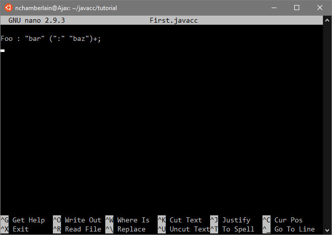

==== Outtakes
Contains text and fragments that were too good to throw away but shouldn't be included in final doc

- - -
......A huge number of text editors are available at every price point, from free to astronomically expensive. The choice is yours as long as it can produce plain unformatted text files and you find it _good enough_ to use. If you don't have a favorite text editor, it is suggested that you download and learn one of the free text editors that came with your OS distribution. 

====
*Tangent:* For most Linux distributions, the _good enough_ text editor I refer to above is `nano`, not `vim`. `Vim` is usually installed on most Unix and Linux distributions, but unless you are already familiar with vim` (or its predecessor `vi`), it would be masochistic to use it for this tutorial!
====

For the rest of this tutorial, `nano` will be used simply because it is _good enough_. In the following screenshot of `nano`, we can see that it displays the text plainly and includes a brief menu of the most frequently used keyboard shortcuts and commands.

- - -
- - -
NOTE: It is likely that many readers (in particular, those who spend a lot of time on the command line) could skip the rest of this section and move on to the link:ch-0.html[first example - investigate why this link doesn't work in preview].

On Windows, not so much. You can, of course, go through the tutorial on a Windows machine, but:

* You understand that when I say something like: "Now you type `rm *.java` to delete the generated source files" this has to be `del *.java` on a default Windows command line.
* You use some sort of Unix shell on your Windows machine.
* Another perfectly reasonable possibility is that you remote login into a Unix machine and do the tutorial there -- the only prerequisite being, again, that the remote machine has a JDK installed.
