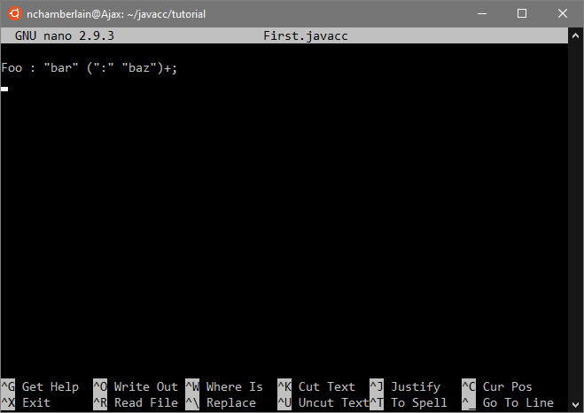

== JavaCC Tutorial Preface

In this chapter we will get setup and then generate a parser for the BarBaz language. BarBaz is non-functional and nonsensical language whose only virtue is its extreme simplicity. BarBaz is the parser equivalent of the classic "hello world" program, which exists solely to demonstrate the simplest possible compilable program in many languages.

=== Audience

Broadly speaking, the audience for this tutorial can be divided into three groups:

. *Novice user.* You have little or no background in the parser generator space, either JavaCC or any other such tools.
. *Parser user.* Users with parser generator experience. Typically, you will have used https://en.wikipedia.org/wiki/Yacc[Yacc] or https://en.wikipedia.org/wiki/GNU_Bison[Bison] or possibly https://antlr.org/[ANTLR], so the basic concepts are not new.
. *Legacy user.* Users of the https://javacc.org/[_legacy_ JavaCC tool]. You are familiar with the original JavaCC tool and want to learn about JavaCC 21 or upgrade to it.

This chapter is written primarily for the first group, the novices. 

=== Conventions

Material appropriate for parser users and legacy users will be identified as such. So, for example, if I write:

NOTE: *Parser user:* The information contained in this Note will apply to users of other parsers, usually to relate basic concepts used with those parsers to how those concepts apply to the JavaCC 21 tool.

NOTE: *Legacy user:* The information contained in this Note will apply to users of the _legacy_ tool, perhaps to explain why certain choices or options are _made_ or _omitted_ or to display _legacy_ code.

NOTE: *Windows user:* Most instructions and operations are performed at the command line and assume that you have set up your Windows computer to access the command prompt. Depending on your Windows setup (WSL or WSL-2 or VS Code terminal or IDE or PowerShell, etc.), you may have to adjust the commands you use (del * vs rm *) yourself because the specific instructions for each possible variation will not be provided.

If you are a novice user, you can skip such notes so you don't get bogged down in details unneeded to complete this tutorial but are more relevant to other users. If you're curious (always a good trait), go ahead and read the notes, but don't worry if they seem irrelevant or don't make sense - just keep plunging ahead with the tutorial.

Also, I might occasionally go off on a tangent and I'll mark it so that people who are in a hurry can skip over that.

====
*Tangent:* __Some information that is potentially useful (or failing that, amusing at least) but could easily be skipped if you are in a hurry.__
====

As for people's background in the parser generator space, this is not a dry theoretical treatise and I am no theoretician anyway. It is a hands-on tutorial. However, certain theoretical concepts will be introduced as one goes through the tutorial. I will mark sections that introduce or discuss basic concepts so those with a good theoretical grounding in this space can glance thru or simply ignore.

All right, let's get started...

//=== The Basic Approach (And I mean _Basic_)   SAVE THIS HEADING FOR LATER

=== Toolset and Configuration
This tutorial will assume a _lowest common denominator_ toolset. While this may require a little more typing on your part, it also will provide the most consistent behavior across platforms and software configurations, ensuring that your results will turn out as shown in this tutorial. This toolset will require the following:

* You have JDK 1.8 or higher installed.
* You can type commands like `java` and `javac` on the command line.
* You have JavaCC 21 installed.
* You have a text editor that you are comfortable using to edit the various examples.

If you are comfortable with the command line and believe that your environment is setup (including javacc-full.jar), you can skip ahead to the Configuration Check section and if everything works OK, you can move on to the first example.

==== Java
Many Java 8 (1.8) or later products are available, including:

* Oracle Java JDK (personal/free or commercial version)
* OpenJDK
* Azul JDK
* Others

Each of these products offer their own advantages and set of platforms supported. JavaCC 21 should work fine with any of them, as long as you have installed a Java Development Kit (JDK). The Java Runtime Environment (JRE) by itself doesn't include the necessary tools. 

Select your desired JDK and follow their installation instructions. If asked, allow the installer application to include the location of the JDK in your path.

Because of Oracle's current 6-month cadence for releasing new Java versions with new (and sometimes revolutionary) features, JavaCC 21 may not (yet) support these latest features.

==== Command Line
If you are running Unix or Linux with a GUI or the Mac OS, you're all set: just open a terminal window. Obviously, if you're running Unix or Linux, your command line is already available. 

NOTE: *Windows 10 users:* the WSL (Windows Subsystem for Linux) will provide a true Linux experience and is probably your best choice for this tutorial. As a second choice, the new Windows Terminal program is quite powerful; it defaults to the PowerShell command line but tabs can be added for other style command lines, including logging into a remote Azure server. The latest version of PowerShell can also be used to enter most bash command. Finally, the familiar Windows Command Prompt can be used although some of the commands will be different.

To verify your command line, enter:

....
% ls
....

A list of the directories and files of the current directory will be displayed. If not, stop and figure out why your command line isn't working.

==== Install JavaCC 21
Using JavaCC 21 requires javacc-full.jar which contains all of the logic and functionality needed to process your grammar files. Download the latest JavaCC 21 from https://javacc.com/download/javacc-full.jar[here]. Using this link will place the jar file in your standard download location.

If you prefer to use the command line, one (or either) of the following commands in your shell should also do the trick:

....
% curl -O https://javacc.com/download/javacc-full.jar

% wget https://javacc.com/download/javacc-full.jar
....

These commands will download javacc-full.jar into your current directory. You will probably want to move the jar file someplace useful later on

NOTE: *Windows users:* The latest versions of Windows 10 include both curl and wget commands in PowerShell and in the new Windows Terminal. Only the curl command is available by default in Windows 10 Command Prompt.

==== Text Editor
A huge number of text editors are available at every price point, from free to astronomically expensive. The choice is yours as long as it can produce plain unformatted text files and you find it _good enough_ to use. If you don't have a favorite text editor, it is suggested that you download and learn one of the free text editors that came with your OS distribution. 

====
*Tangent:* For most Linux distributions, the _good enough_ text editor I refer to above is `nano`, not `vim`. `Vim` is usually installed on most Unix and Linux distributions, but unless you are already familiar with vim` (or its predecessor `vi`), it would be masochistic to use it for this tutorial!
====

For the rest of this tutorial, `nano` will be used simply because it is _good enough_. In the following screenshot of `nano`, we can see that it displays the text plainly and includes a brief menu of the most frequently used keyboard shortcuts and commands.

==== Configuration Check

Now let's quickly check that you have everything you need. On your command line type:

....
% java -version
....

and if that worked:

....
% javac -version
....

In both cases, the version it gives you should be 1.8.x or greater.

So you should now also be able to type:

....
% java -jar javacc-full.jar 
....

Because no grammar file was specified after the jar file, it will print a brief description of the available options and then exit.

If all of these checks did not produce the expected result, troubleshoot the issues until the correct results are produced. Once everything is working correctly, continue with the First Example section.

....

....

- - -
FOLLOWING TEXT HAS NOT BEEN PROCESSED

//NOTE: It is likely that many readers (in particular, those who spend a lot of time on the command line) could skip the rest of this section and move on to the link:ch-0.html[first example - investigate why this link doesn't work in preview].

Though it is not really mandatory, this exposition will make a sort of _default assumption_ that your command line is some sort of Unixy shell. On Mac or Linux, this is a given. On Windows, not so much. You can, of course, go through the tutorial on a Windows machine, but:

* You understand that when I say something like: "Now you type `rm *.java` to delete the generated source files" this has to be `del *.java` on a default Windows command line.
* You use some sort of Unix shell on your Windows machine.
* Another perfectly reasonable possibility is that you remote login into a Unix machine and do the tutorial there -- the only prerequisite being, again, that the remote machine has a JDK installed.

Of the options above, I would probably lean towards the second one. If you don't already have it, the easiest thing is just to install the https://git-scm.com/download/win[Git for Windows package]. That gives you gives you the command-line https://en.wikipedia.org/wiki/Git[Git] client and a UNIX terminal emulator with the default BASH (Bourne Again Shell) command line. (This also gives you a _good enough_ plain text editor you can use.)

NOTE: I am not at all suggesting that this toolset (JDK + command line) is optimal. IDE's like Eclipse and IntelliJ exist for a reason (for _many_ reasons) and so do modern build tools like Maven or Gradle. This tutorial takes this _lowest common denominator_ approach because the ability to do everything with JDK + command line seems like the best way to demystify what is really going on.

=== Before the Next Step

TIP: Since you'll likely be typing the above command quite a bit as you go through the tutorial, I suggest that you create a shortcut
to execute it, something like: 

....
% alias jcc='java -jar ~/java/libs/javacc-full.jar'
....

Now you should be able to type `jcc` to invoke JavaCC. Well, try it:

....
% jcc
....

TIP: The normal thing to do would be to add that above alias line to your shell configuration file, most likely `$HOME/.bashrc`

====
*Note for Windows Users:* You can get the effect of the above alias command on a default Windows command line via:

     > doskey jcc=java -jar <PATH_TO_JAR_FILE>\javacc-full.jar $*

Note that the `$*` in the above is very important, because otherwise, any parameters you add to the command-line will be ignored!

*TANGENT:* This, by the way, was an exciting new feature added to MS-DOS 5.0 in 1990, I think. I was surprised to discover recently that it still works! 
====

Now that we have these details out of the way, we can move on to link:ch-00.html[our first example]